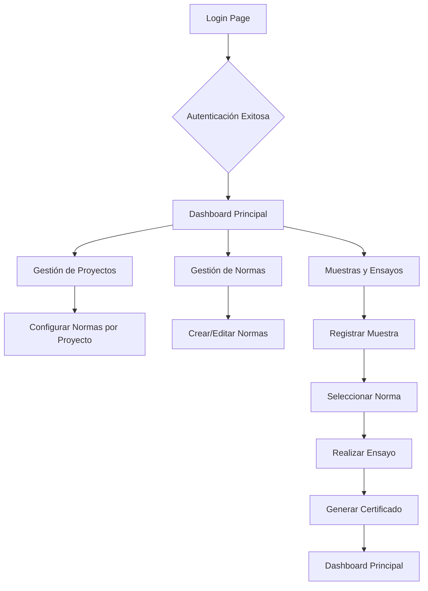

## 1. Product Overview

Construction Lab SaaS es una plataforma moderna de gestión de laboratorios de construcción que permite la administración completa de normas técnicas (NMX mexicanas, ACI/ASTM internacionales, normas locales y especificaciones privadas), proyectos de construcción, muestras de materiales y ensayos de calidad. El sistema está diseñado para laboratorios que necesitan flexibilidad total en la gestión de normas por proyecto, con certificados adaptables y flujos de trabajo personalizados.

El producto resuelve el problema de la rigidez en los sistemas tradicionales de laboratorio, permitiendo que cada proyecto use normas específicas según requisitos del cliente, ya sean normas mexicanas oficiales, estándares internacionales o especificaciones privadas del constructor.

## 2. Core Features

### 2.1 User Roles

| Role | Registration Method | Core Permissions |
|------|---------------------|------------------|
| Administrador | Email registration | Crea/edita normas personalizadas, configura proyectos, gestiona usuarios |
| Técnico de Laboratorio | Email registration | Usa normas asignadas al proyecto, registra muestras, realiza ensayos |
| Residente de Obra | Email registration | Valida resultados vs límites de norma específica, aprueba certificados |
| Gerente de Proyecto | Email registration | Visualiza informes por tipo norma/proyecto, KPI mixtos, exporta certificados |

### 2.2 Feature Module

Nuestro Construction Lab SaaS consiste en las siguientes páginas principales:

1. **Dashboard Principal**: métricas generales, cumplimiento por norma, proyectos activos, muestras recientes
2. **Gestión de Normas**: catálogo de normas (NMX, ACI/ASTM, locales), editor de plantillas, campos configurables
3. **Proyectos**: lista de proyectos, configuración de normas por proyecto, asignación de usuarios
4. **Muestras**: recepción QR, registro de muestras, asignación de normas específicas
5. **Ensayos**: configuración de ensayos por norma, registro de resultados, validación dinámica
6. **Certificados**: generación de PDFs adaptables, códigos QR verificables, exportación por lotes
7. **Configuración de Cuenta**: perfil de usuario, preferencias, notificaciones
8. **Planes y Precios**: información de suscripciones, comparación de planes
9. **Login**: autenticación de usuarios, recuperación de contraseña
10. **Registro**: creación de cuenta, verificación de email

### 2.3 Page Details

| Page Name | Module Name | Feature description |
|-----------|-------------|---------------------|
| Dashboard Principal | Métricas Generales | Muestra KPIs principales: total proyectos, muestras del mes, % cumplimiento por norma, gráficos de tendencias |
| Dashboard Principal | Filtros Dinámicos | Filtrar por tipo de norma, proyecto, fecha, estado de cumplimiento |
| Dashboard Principal | Tabla de Muestras Recientes | Lista con proyecto, norma aplicada, resultado, estado (verde/amarillo/rojo) |
| Gestión de Normas | Catálogo de Normas | Búsqueda y filtro por tipo (NMX, ACI/ASTM, Local, Privada), vista previa de campos |
| Gestión de Normas | Editor de Normas | Agregar/editar campos dinámicos, definir límites de validación, fórmulas de cálculo |
| Gestión de Normas | Importar/Exportar | Carga masiva de normas desde Excel/CSV, exportar plantillas |
| Proyectos | Lista de Proyectos | Tabla con nombre, cliente, normas asignadas, estado, fecha de inicio |
| Proyectos | Configuración de Normas | Asignar múltiples normas por proyecto, definir norma principal por tipo de ensayo |
| Proyectos | Asignación de Usuarios | Agregar técnicos, residentes, gerentes con permisos específicos por proyecto |
| Muestras | Recepción QR | Escáner de códigos QR para auto-completar proyecto y tipo de material |
| Muestras | Registro Manual | Formulario con campos dinámicos según norma seleccionada, validación en tiempo real |
| Muestras | Asignación de Norma | Dropdown con búsqueda inteligente para seleccionar norma específica por muestra |
| Ensayos | Configuración de Parámetros | Definir valores de referencia, tolerancias, método de ensayo según norma |
| Ensayos | Registro de Resultados | Ingresar valores de ensayo, validación automática contra límites de norma |
| Ensayos | Cálculos Automáticos | Aplicar fórmulas configuradas en la norma, mostrar resultados intermedios |
| Certificados | Generador PDF | Plantilla adaptable según norma usada, incluye logo del laboratorio, datos de la norma |
| Certificados | Código QR Verificable | Generar QR único que enlaza a página pública de verificación con resultados originales |
| Certificados | Exportación por Lotes | Seleccionar múltiples certificados por proyecto, norma o fecha, descarga ZIP |
| Configuración de Cuenta | Perfil de Usuario | Editar nombre, email, foto, cambiar contraseña, configurar notificaciones |
| Configuración de Cuenta | Preferencias de Tema | Switch persistente claro/oscuro con localStorage, selector de idioma |
| Login | Formulario de Autenticación | Email y contraseña, recordar sesión, link a recuperación de contraseña |
| Login | Recuperación de Contraseña | Enviar email con enlace de restablecimiento, validación de token temporal |
| Registro | Formulario de Creación | Nombre completo, email, contraseña, confirmación de contraseña, términos y condiciones |
| Registro | Verificación de Email | Enviar código de verificación, validar cuenta antes del primer acceso |

## 3. Core Process

### Flujo Principal de Usuario Técnico:
1. El técnico inicia sesión y accede al dashboard
2. Selecciona el proyecto activo asignado
3. Escanea el QR de la muestra o registra manualmente
4. Selecciona la norma específica del proyecto
5. Completa los campos del ensayo según la norma
6. El sistema valida automáticamente contra límites configurados
7. Genera el certificado con la norma aplicada
8. El residente valida y aprueba el certificado

### Flujo de Administrador:
1. El administrador configura las normas base del laboratorio
2. Crea proyectos y asigna normas específicas por cliente
3. Asigna usuarios con roles específicos a cada proyecto
4. Monitorea el cumplimiento general desde el dashboard
5. Exporta informes consolidados por norma o proyecto

## 4. User Interface Design

### 4.1 Design Style

**Colores Principales:**
- Verde principal: #25A418 (botones de acción, enlaces, highlights)
- Fondo claro: #F4F4F4, #FFFFFF
- Texto claro: #282828, #555555
- Fondo oscuro: #0B0B0B
- Texto oscuro: #E5E5E5, #B0B0B0

**Estilo de Componentes:**
- Botones: Estilo moderno con bordes redondeados (8-12px), sombras sutiles (0 4px 6px -1px rgba(0,0,0,0.1))
- Tarjetas: Bordes redondeados (12-16px), sombra suave, padding generoso (24-32px)
- Inputs: Bordes de 2px, radio 8px, estados de focus con anillo verde
- Animaciones: Transiciones suaves (200-300ms), hover effects sutiles

**Tipografía:**
- Fuente principal: Inter (moderna y legible)
- Títulos: 32px/40px (H1), 24px/32px (H2), 20px/28px (H3)
- Texto: 16px/24px (body), 14px/20px (small)
- Botones: 16px/24px, peso medio (500)

**Iconografía:**
- Iconos minimalistas de Heroicons o Lucide
- Tamaño consistente: 20px para navegación, 16px para acciones
- Colores coherentes con el tema activo

### 4.2 Page Design Overview

| Page Name | Module Name | UI Elements |
|-----------|-------------|-------------|
| Dashboard Principal | Header | Logo, barra de búsqueda, notificaciones, avatar de usuario, switch tema |
| Dashboard Principal | Métricas Cards | Grid de 4-6 tarjetas con iconos, valores grandes, tendencias porcentuales |
| Dashboard Principal | Tabla de Muestras | Tabla con filas alternadas, badges de estado coloreados, acciones hover |
| Gestión de Normas | Lista de Normas | Sidebar con categorías, tabla principal con filtros, botón "Nueva Norma" |
| Gestión de Normas | Editor de Normas | Formulario multi-step, campos dinámicos drag-and-drop, preview en tiempo real |
| Proyectos | Grid de Proyectos | Tarjetas con imagen, nombre, cliente, badges de normas, barra de progreso |
| Proyectos | Detalle de Proyecto | Tabs para información, normas, usuarios, timeline de actividad |
| Muestras | Formulario QR | Scanner con cámara, preview del código, auto-completado de campos |
| Muestras | Formulario Manual | Steps visuales, validación por campo, ayuda contextual, botón guardar borrador |
| Ensayos | Configuración | Tabla editable inline, validación visual, tooltips informativos |
| Ensayos | Resultados | Formulario adaptativo según norma, gráficos de tendencia, validación en tiempo real |
| Certificados | Vista Previa | PDF viewer embebido, zoom, paginación, botones de acción flotantes |
| Certificados | Lista de Certificados | Filtros avanzados, selección múltiple, acciones masivas |
| Login | Formulario | Centrado en card, fondo con patrón sutil, logo prominente, links de ayuda |
| Registro | Formulario | Multi-step con indicador de progreso, validación inline, términos checkbox |

### 4.3 Responsiveness

- **Desktop-first approach**: Diseño optimizado para pantallas de 1440px y superiores
- **Breakpoints**: 640px (mobile), 768px (tablet), 1024px (desktop), 1280px (large)
- **Mobile adaptation**: Menú hamburguesa, tarjetas apiladas verticalmente, formularios de columna única
- **Touch optimization**: Botones mínimo 44x44px, espaciado generoso, gestos de swipe en tablas
- **Fluid typography**: Escalado proporcional usando clamp() para mantener legibilidad

### 4.4 Accessibility

- **Contraste WCAG AA**: Ratio mínimo 4.5:1 para texto normal, 3:1 para grande
- **Focus indicators**: Anillos de focus visibles con color verde (#25A418)
- **Screen reader support**: Labels ARIA apropiados, roles semánticos, alt text en imágenes
- **Navegación por teclado**: Tab order lógico, shortcuts para acciones principales
- **Estados de error claros**: Mensajes descriptivos, colores y iconos consistentes
- **Tamaño de texto base**: 16px mínimo, escalable hasta 200% sin pérdida de funcionalidad