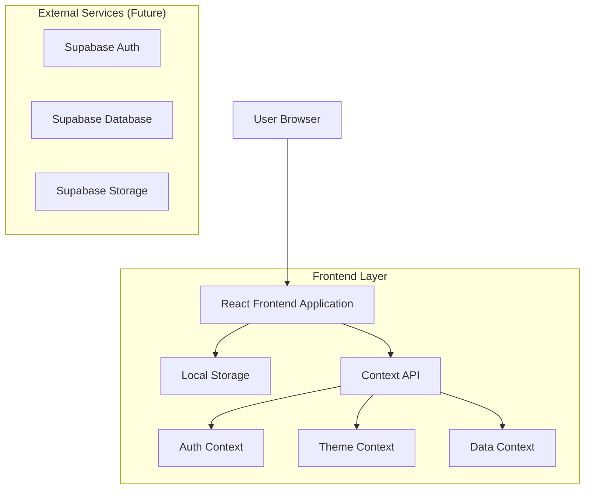

## 1. Architecture design



## 2. Technology Description

* **Frontend**: React\@18 + Tailwind CSS\@4 + Vite\@7

* **Initialization Tool**: vite-init

* **Package Manager**: pnpm

* **Backend**: None (local development with mock data)

* **Database**: None (local storage and context API for development)

**Core Dependencies:**

* react\@18.2.0

* react-dom\@18.2.0

* react-router-dom\@6.20.0

* <tailwindcss@4.0.0-alpha>

* @tailwindcss/forms\@0.5.7

* lucide-react\@0.294.0

* clsx\@2.0.0

* react-hook-form\@7.48.0

* @hookform/resolvers\@3.3.0

* zod\@3.22.0

**Development Dependencies:**

* vite\@7.0.0

* @vitejs/plugin-react\@4.2.0

* autoprefixer\@10.4.16

* postcss\@8.4.32

* eslint\@8.55.0

* @types/react\@18.2.43

* @types/react-dom\@18.2.17

## 3. Route definitions

| Route             | Purpose                                                        |
| ----------------- | -------------------------------------------------------------- |
| /                 | Dashboard principal, muestra métricas y actividad reciente     |
| /login            | Página de autenticación, formulario de email y contraseña      |
| /register         | Página de registro, formulario de creación de cuenta           |
| /forgot-password  | Recuperación de contraseña, envío de email de restablecimiento |
| /dashboard        | Dashboard principal después del login                          |
| /normas           | Gestión de normas técnicas, catálogo y editor                  |
| /normas/new       | Crear nueva norma personalizada                                |
| /normas/:id       | Editar norma existente                                         |
| /proyectos        | Lista de proyectos de construcción                             |
| /proyectos/new    | Crear nuevo proyecto                                           |
| /proyectos/:id    | Detalle del proyecto con normas asignadas                      |
| /muestras         | Gestión de muestras de materiales                              |
| /muestras/new     | Registrar nueva muestra                                        |
| /muestras/:id     | Detalle y ensayos de la muestra                                |
| /ensayos          | Lista de ensayos programados y realizados                      |
| /ensayos/:id      | Registro de resultados de ensayo                               |
| /certificados     | Generación y gestión de certificados                           |
| /certificados/:id | Vista previa y descarga de certificado                         |
| /account          | Configuración de cuenta y perfil de usuario                    |
| /planes           | Información de planes y precios del SaaS                       |

## 4. Project Structure

```
src/
├── components/
│   ├── common/
│   │   ├── Button.jsx
│   │   ├── Input.jsx
│   │   ├── Card.jsx
│   │   ├── Modal.jsx
│   │   ├── Table.jsx
│   │   └── Badge.jsx
│   ├── layout/
│   │   ├── Header.jsx
│   │   ├── Sidebar.jsx
│   │   ├── Footer.jsx
│   │   └── MainLayout.jsx
│   ├── auth/
│   │   ├── LoginForm.jsx
│   │   ├── RegisterForm.jsx
│   │   ├── ForgotPasswordForm.jsx
│   │   └── ProtectedRoute.jsx
│   ├── dashboard/
│   │   ├── MetricsCard.jsx
│   │   ├── Chart.jsx
│   │   └── RecentActivity.jsx
│   ├── normas/
│   │   ├── NormaList.jsx
│   │   ├── NormaEditor.jsx
│   │   ├── FieldBuilder.jsx
│   │   └── NormaPreview.jsx
│   ├── proyectos/
│   │   ├── ProjectCard.jsx
│   │   ├── ProjectForm.jsx
│   │   └── ProjectDetail.jsx
│   ├── muestras/
│   │   ├── SampleForm.jsx
│   │   ├── QRScanner.jsx
│   │   ├── SampleList.jsx
│   │   └── SampleDetail.jsx
│   └── certificados/
│       ├── CertificateGenerator.jsx
│       ├── CertificatePreview.jsx
│       └── QRGenerator.jsx
├── pages/
│   ├── Home.jsx
│   ├── Login.jsx
│   ├── Register.jsx
│   ├── Dashboard.jsx
│   ├── Normas.jsx
│   ├── Proyectos.jsx
│   ├── Muestras.jsx
│   ├── Ensayos.jsx
│   ├── Certificados.jsx
│   └── Account.jsx
├── hooks/
│   ├── useAuth.js
│   ├── useTheme.js
│   ├── useLocalStorage.js
│   ├── useForm.js
│   └── useQR.js
├── context/
│   ├── AuthContext.jsx
│   ├── ThemeContext.jsx
│   ├── DataContext.jsx
│   └── NotificationContext.jsx
├── services/
│   ├── auth.service.js
│   ├── normas.service.js
│   ├── proyectos.service.js
│   ├── muestras.service.js
│   └── certificados.service.js
├── utils/
│   ├── validators.js
│   ├── calculations.js
│   ├── formatters.js
│   └── constants.js
├── styles/
│   ├── globals.css
│   ├── tailwind.css
│   └── components.css
├── data/
│   ├── mockNormas.js
│   ├── mockProyectos.js
│   ├── mockMuestras.js
│   └── mockUsers.js
└── App.jsx
```

## 5. Authentication Architecture

### 5.1 Local Authentication Flow

```javascript
// AuthContext.jsx - Simplified version
const AuthContext = createContext();

export const AuthProvider = ({ children }) => {
  const [user, setUser] = useState(null);
  const [loading, setLoading] = useState(true);

  useEffect(() => {
    // Check localStorage for existing session
    const storedUser = localStorage.getItem('user');
    if (storedUser) {
      setUser(JSON.parse(storedUser));
    }
    setLoading(false);
  }, []);

  const login = async (email, password) => {
    // Mock authentication - replace with real API call
    const mockUser = mockUsers.find(u => u.email === email && u.password === password);
    if (mockUser) {
      const userData = { 
        id: mockUser.id, 
        email: mockUser.email, 
        role: mockUser.role,
        name: mockUser.name 
      };
      setUser(userData);
      localStorage.setItem('user', JSON.stringify(userData));
      return { success: true };
    }
    return { success: false, error: 'Invalid credentials' };
  };

  const logout = () => {
    setUser(null);
    localStorage.removeItem('user');
  };

  return (
    <AuthContext.Provider value={{ user, login, logout, loading }}>
      {children}
    </AuthContext.Provider>
  );
};
```

### 5.2 Role-Based Access Control

```javascript
// ProtectedRoute.jsx
const ProtectedRoute = ({ children, allowedRoles }) => {
  const { user, loading } = useAuth();
  const location = useLocation();

  if (loading) {
    return <LoadingSpinner />;
  }

  if (!user) {
    return <Navigate to="/login" state={{ from: location }} replace />;
  }

  if (allowedRoles && !allowedRoles.includes(user.role)) {
    return <Navigate to="/unauthorized" replace />;
  }

  return children;
};
```

## 6. Theme System

### 6.1 Tailwind Configuration

```javascript
// tailwind.config.js
export default {
  content: ['./index.html', './src/**/*.{js,ts,jsx,tsx}'],
  darkMode: 'class',
  theme: {
    extend: {
      colors: {
        primary: {
          50: '#f0fdf4',
          100: '#dcfce7',
          200: '#bbf7d0',
          300: '#86efac',
          400: '#4ade80',
          500: '#25A418',
          600: '#16a34a',
          700: '#15803d',
          800: '#166534',
          900: '#14532d',
        },
        gray: {
          50: '#f9fafb',
          100: '#f3f4f6',
          200: '#e5e7eb',
          300: '#d1d5db',
          400: '#9ca3af',
          500: '#6b7280',
          600: '#4b5563',
          700: '#374151',
          800: '#1f2937',
          900: '#111827',
        }
      },
      fontFamily: {
        sans: ['Inter', 'system-ui', 'sans-serif'],
      },
      animation: {
        'fade-in': 'fadeIn 0.3s ease-in-out',
        'slide-up': 'slideUp 0.3s ease-out',
      }
    }
  },
  plugins: [
    require('@tailwindcss/forms'),
  ]
}
```

### 6.2 Theme Context

```javascript
// ThemeContext.jsx
const ThemeContext = createContext();

export const ThemeProvider = ({ children }) => {
  const [theme, setTheme] = useState('light');

  useEffect(() => {
    const savedTheme = localStorage.getItem('theme') || 'light';
    setTheme(savedTheme);
    document.documentElement.classList.toggle('dark', savedTheme === 'dark');
  }, []);

  const toggleTheme = () => {
    const newTheme = theme === 'light' ? 'dark' : 'light';
    setTheme(newTheme);
    localStorage.setItem('theme', newTheme);
    document.documentElement.classList.toggle('dark', newTheme === 'dark');
  };

  return (
    <ThemeContext.Provider value={{ theme, toggleTheme }}>
      {children}
    </ThemeContext.Provider>
  );
};
```

## 7. Data Models (Mock Implementation)

### 7.1 User Model

```javascript
// Mock User Structure
const user = {
  id: 'uuid',
  email: 'usuario@laboratorio.com',
  name: 'Juan Pérez',
  role: 'administrador', // administrador | tecnico | residente | gerente
  avatar: '/avatars/juan.jpg',
  preferences: {
    theme: 'light',
    language: 'es',
    notifications: true
  },
  createdAt: '2024-01-15T10:30:00Z',
  lastLogin: '2024-12-27T08:15:00Z'
};
```

### 7.2 Norma Model

```javascript
// Mock Norma Structure
const norma = {
  id: 'uuid',
  codigo: 'NMX-C-414',
  nombre: 'Concreto hidráulico - Muestreo y revisión de concretos',
  tipo: 'NMX', // NMX | ACI | ASTM | Local | Privada
  descripcion: 'Establece los procedimientos para el muestreo y revisión de concretos hidráulicos',
  campos: [
    {
      id: 'field_1',
      nombre: 'Resistencia a la compresión',
      tipo: 'number',
      unidad: 'MPa',
      limiteMin: 20,
      limiteMax: 40,
      esRequerido: true,
      formula: null
    }
  ],
  proyectos: ['project_1', 'project_2'],
  activa: true,
  creadaPor: 'user_1',
  createdAt: '2024-01-01T00:00:00Z'
};
```

### 7.3 Proyecto Model

```javascript
// Mock Proyecto Structure
const proyecto = {
  id: 'uuid',
  nombre: 'Torre XYZ',
  cliente: 'Constructora ABC',
  descripcion: 'Edificio residencial de 25 pisos',
  direccion: 'Av. Principal 123, Ciudad',
  normasAsignadas: ['norma_1', 'norma_2'],
  usuarios: [
    { userId: 'user_1', rol: 'administrador' },
    { userId: 'user_2', rol: 'tecnico' }
  ],
  estado: 'activo', // activo | completado | pausado
  fechaInicio: '2024-01-01',
  fechaFin: '2024-12-31',
  createdAt: '2024-01-01T00:00:00Z'
};
```

### 7.4 Muestra Model

```javascript
// Mock Muestra Structure
const muestra = {
  id: 'uuid',
  codigo: 'MUE-2024-001',
  proyectoId: 'project_1',
  normaId: 'norma_1',
  tipoMaterial: 'Concreto',
  fechaRecepcion: '2024-12-27T09:00:00Z',
  fechaEnsayo: '2024-01-24T10:00:00Z',
  ubicacion: 'Piso 5, Columna C-3',
  proveedor: 'Proveedor XYZ',
  qrCode: 'QR123456789',
  resultados: {
    resistenciaCompresion: 28.5,
    slump: 150,
    // ... otros campos según norma
  },
  estado: 'aprobado', // pendiente | en_proceso | aprobado | rechazado
  tecnicoId: 'user_2',
  residenteId: 'user_3',
  certificadoId: 'cert_1',
  observaciones: 'Muestra tomada según procedimiento estándar',
  createdAt: '2024-12-27T09:00:00Z'
};
```

## 8. Component Architecture

### 8.1 Reusable Components

**Button Component Example:**

```javascript
// components/common/Button.jsx
const Button = ({ 
  children, 
  variant = 'primary', 
  size = 'md', 
  disabled = false,
  loading = false,
  onClick,
  className,
  ...props 
}) => {
  const baseClasses = 'inline-flex items-center justify-center font-medium rounded-lg transition-colors focus:outline-none focus:ring-2 focus:ring-offset-2';
  
  const variants = {
    primary: 'bg-primary-600 text-white hover:bg-primary-700 focus:ring-primary-500',
    secondary: 'bg-gray-200 text-gray-900 hover:bg-gray-300 focus:ring-gray-500',
    outline: 'border border-gray-300 text-gray-700 hover:bg-gray-50 focus:ring-primary-500',
    ghost: 'text-gray-700 hover:bg-gray-100 focus:ring-gray-500'
  };
  
  const sizes = {
    sm: 'px-3 py-2 text-sm',
    md: 'px-4 py-2 text-base',
    lg: 'px-6 py-3 text-lg'
  };
  
  const classes = clsx(
    baseClasses,
    variants[variant],
    sizes[size],
    disabled && 'opacity-50 cursor-not-allowed',
    loading && 'relative',
    className
  );
  
  return (
    <button 
      className={classes} 
      disabled={disabled || loading}
      onClick={onClick}
      {...props}
    >
      {loading && (
        <svg className="animate-spin -ml-1 mr-3 h-5 w-5" viewBox="0 0 24 24">
          {/* Spinner SVG */}
        </svg>
      )}
      {children}
    </button>
  );
};
```

### 8.2 Form Components with Validation

**Input Component Example:**

```javascript
// components/common/Input.jsx
const Input = ({ 
  label, 
  error, 
  helperText,
  required,
  className,
  ...props 
}) => {
  return (
    <div className="space-y-1">
      {label && (
        <label className="block text-sm font-medium text-gray-700 dark:text-gray-300">
          {label}
          {required && <span className="text-red-500 ml-1">*</span>}
        </label>
      )}
      <input
        className={clsx(
          'block w-full px-3 py-2 border rounded-lg shadow-sm',
          'placeholder-gray-400 focus:outline-none focus:ring-2 focus:ring-primary-500',
          'border-gray-300 focus:border-primary-500',
          'dark:bg-gray-800 dark:border-gray-600 dark:text-white',
          error && 'border-red-500 focus:ring-red-500',
          className
        )}
        {...props}
      />
      {error && (
        <p className="text-sm text-red-600 dark:text-red-400">{error}</p>
      )}
      {helperText && !error && (
        <p className="text-sm text-gray-500 dark:text-gray-400">{helperText}</p>
      )}
    </div>
  );
};
```

## 9. State Management

### 9.1 Context API Structure

**Data Context for Mock Data:**

```javascript
// context/DataContext.jsx
const DataContext = createContext();

export const DataProvider = ({ children }) => {
  const [normas, setNormas] = useState(mockNormas);
  const [proyectos, setProyectos] = useState(mockProyectos);
  const [muestras, setMuestras] = useState(mockMuestras);
  
  const addNorma = (norma) => {
    setNormas([...normas, { ...norma, id: uuid() }]);
  };
  
  const updateNorma = (id, updatedNorma) => {
    setNormas(normas.map(n => n.id === id ? { ...n, ...updatedNorma } : n));
  };
  
  const addMuestra = (muestra) => {
    setMuestras([...muestras, { ...muestra, id: uuid(), codigo: generateSampleCode() }]);
  };
  
  return (
    <DataContext.Provider value={{
      normas, proyectos, muestras,
      addNorma, updateNorma, addMuestra
    }}>
      {children}
    </DataContext.Provider>
  );
};
```

## 10. Future Integration Points

### 10.1 Supabase Integration (Future)

When ready to integrate with Supabase:

1. **Install Supabase dependencies:**

```bash
pnpm install @supabase/supabase-js
```

1. **Create Supabase client:**

```javascript
// lib/supabase.js
import { createClient } from '@supabase/supabase-js';

const supabaseUrl = import.meta.env.VITE_SUPABASE_URL;
const supabaseAnonKey = import.meta.env.VITE_SUPABASE_ANON_KEY;

export const supabase = createClient(supabaseUrl, supabaseAnonKey);
```

1. **Replace mock services with real API calls:**

```javascript
// services/normas.service.js
export const normasService = {
  async getAll() {
    const { data, error } = await supabase
      .from('normas')
      .select('*')
      .order('created_at', { ascending: false });
    
    if (error) throw error;
    return data;
  },
  
  async create(norma) {
    const { data, error } = await supabase
      .from('normas')
      .insert([norma])
      .select()
      .single();
    
    if (error) throw error;
    return data;
  }
};
```

### 10.2 Migration Strategy

1. **Phase 1**: Complete local development with mock data
2. **Phase 2**: Set up Supabase project and database schema
3. **Phase 3**: Migrate authentication to Supabase Auth
4. **Phase 4**: Replace mock services with Supabase calls
5. **Phase 5**: Implement real-time features with Supabase subscriptions

